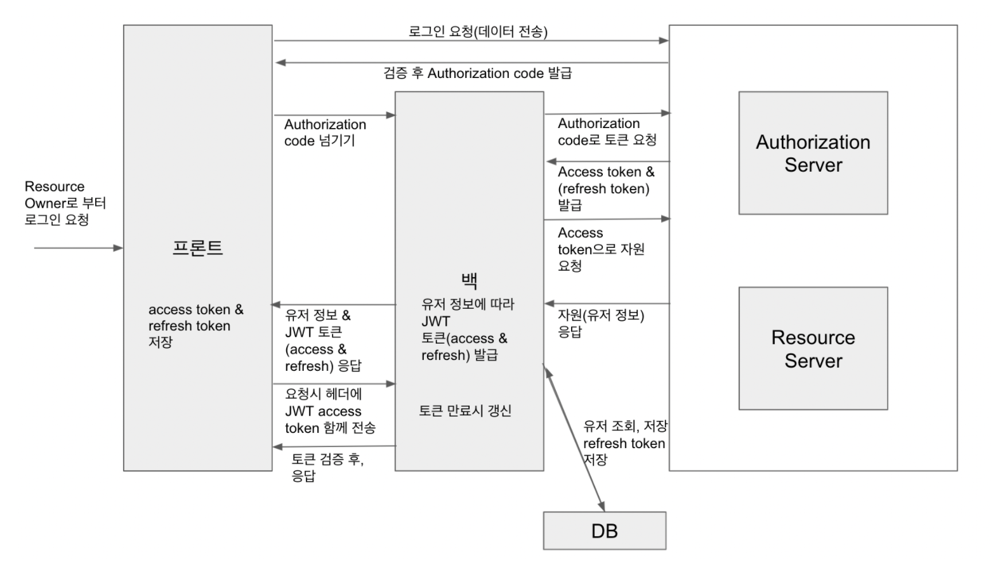

# 코멘트
- [Puzzle 서비스](https://github.com/Frame-in-Puzzle) 에서 Oauth 를 사용하기 위해 공부했습니다.
- Google, Kakao, Naver Oauth는 구현 해본 결과 Gitub와 비슷하여 제외 했습니다.
- 이 레포지토리는 Github Oauth에 중점을 맞춘 레포지토리입니다.
- [김준서님](https://velog.io/@max9106) Oauth 할때, 평소 자료 찾아볼 때 정말 많은 도움이 됐습니다. 감사합니다 !!
- 이 레포지토리를 보시는 분들 모두 [김준서님 Velog](https://velog.io/@max9106) 에서 많은 지식 얻어가세요 !! 

# Oauth 로직
1. 우선 프론트 페이지 에서 https://github.com/login/oauth/authorize?client_id=ccd48be96c643940df44&scope=id,name,email,avatar_url 로 요청을 보낸다.
   위 링크는 깃허브 Oauth 로그인 폼 페이지 이며 중간에 client_id 에 따라서 어떤 개발자가 만든 Oauth 로그인 폼 페이지 인지 달라진다.
   위 링크안에서 로그인을 하면 깃허브에서 해당 유저의 정보와 관련된 매 요청마다 다른 `Authorization code` 를 QueryString 으로 발급해준다.
`http://localhost:8080/redirect/oauth?code=8ffa2a38c846dfb1bb21`
-> 여기서 code = ‘이부분’ 이 `Authorizationg code` 이다.


2. 발급받은 프론트는 백엔드에게 `Authorization code`를
   `http://localhost:8080/login/oauth/github?code=8ffa2a38c846dfb1bb21`
   이런식으로 넘겨준다.


3. 프론트에게 `Authorization code` 를 받은 백엔드는 Spring의 WebClient라는 모듈을 사용하여 Github의 Authorization Server 에 `Authorization code` 를 넘겨주어(요청하여)  Resource Server 에 해당되는 AccessToken을 보냈을때 해당되는 유저의 정보를 가져올 수 있게 해주는 인증 역할을 하는 AccessToken을 발급해준다.

```
여기서잠깐, WebClient란?
간단히 설명하자면 Spring 어플리케이션이 다른 곳으로 HTTP request를 보낼 때 사용하는 모듈이다.

우리가 만드는 Oauth 로직은 spring 서버에서 Gituhb Oauth Server 에 access token 이나, 유저 정보를 얻어오기 위한 요청을 보낼때 사용된다.
```

4. Authorization Server 에서 받은 AccessToken 을 유저의 정보(자원)를 담아두고 있는 Resource Server에 보내주어 AccessToken 에 해당하는 유저의 정보(자원) 을 우리 Spring Server에 보내준다.


5. Spring Server 에서는 받은 정보를 이용하여 DB 에 정보를 저장한다.
   이때, saveOrUpdate라는 메소드(저장하거나 혹은 업데이트) 를 사용하는데
   이 메소드는 매 요청마다 update를 한다.
   (그 이유는 깃허브유저가 정보를 변경했을 수도 있기 때문이다.)


6. 마지막으로 각종정보를 담은 LoginResponse (dto) 를 사용하여 프론트에게 유저 정보를 보내준다.

### 용어 정리
* Resource Owner: 말 그대로 사용자라고 생각하면 된다. 사람이 될 수도 있고, Application 자체가 될 수도 있다.(ex. 나)
* Client Application: 사용자가 사용하는 서비스 애플리케이션. 서버, 데스크톱 등 어떤 기기든 될 수 있다.(ex. velog)
* Resource Server: OAuth를 통해 인증, 인가를 제공해주는 서버. 자원 서버. 자원(이름, 이메일, 프로필 사진 등)을 제공해준다.(ex. github, naver, kakao, google)
* Authorization Server: OAuth를 통해 인증, 인가를 제공해주는 서버. 인증 서버. 토큰을 발급해준다.(ex. github, naver, kakao, google)




### Reference By
> 정말 감사합니다.   
> + https://velog.io/@max9106/OAuth
> + 여러 개발자분들의 블로그